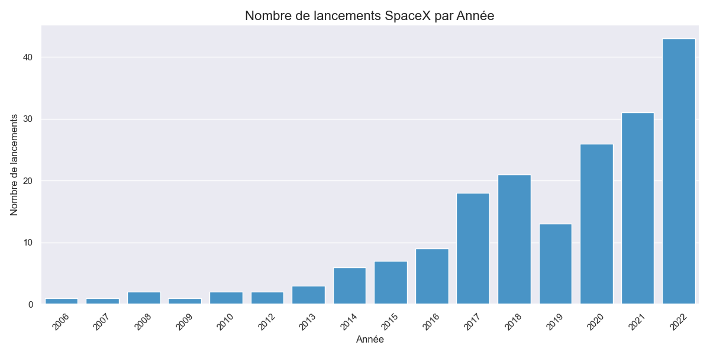

# Projet : API Publique & Visualisation de Données

**Auteur :** Dadou ASSOGBA  
**Cours :** Python Avancé

---

## 1. Objectif

L'objectif de ce projet est de récupérer des données réelles depuis une API publique, de les nettoyer via un script Python, et de visualiser les résultats pour répondre à des questions analytiques.

## 2. Choix de l'API

J'ai choisi l'API publique **SpaceX-API (v4)**.

- **URL :** `https://api.spacexdata.com/v4/launches`
- **Justification :** C'est une API RESTful gratuite qui ne nécessite pas de clé d'authentification (_Auth: No_), ce qui rend le code facilement reproductible. Elle fournit des données réelles et complexes (dates, statuts de mission) idéales pour un projet de visualisation.
- **Motivation personnelle :** J'ai choisi cette API car je suis passionné par le domaine spatial et l'entreprise SpaceX.

## 3. Best of Code & Justifications

J'ai structuré mon code en respectant le principe **ETL** (_Extract, Transform, Load_).

### 3.1 Sauvegarde des données brutes

J'ai choisi de sauvegarder les données brutes avant traitement pour garantir la traçabilité et éviter de surcharger l'API en cas de relance du script.

```python
# Sauvegarde brute
with open(RAW_FILE, "w", encoding="utf-8") as f:
    json.dump(data, f, indent=4)

3.2 Nettoyage des données (Data Cleaning)

L'API renvoyant les lancements futurs (dont le résultat est inconnu), j'ai dû filtrer les données. De plus, j'ai manipulé les chaînes de caractères pour extraire l'année.

for launch in raw_data:
    # 1. On retire les lancements futurs (succès inconnu)
    if launch.get("success") is None:
        continue

    # 2. Extraction de l'année (Format "2020-10-24T..." -> "2020")
    date_utc = launch.get("date_utc", "0000")
    year = date_utc[:4]

## 4. Visualisations

### 4.1 Graphique 1 : Évolution temporelle
Ce graphique montre l'augmentation (très marquée) de la cadence de lancement de SpaceX.



### 4.2 Graphique 2 : Taux de réussite
Ce diagramme montre la fiabilité globale des missions (succès vs échecs).


```
